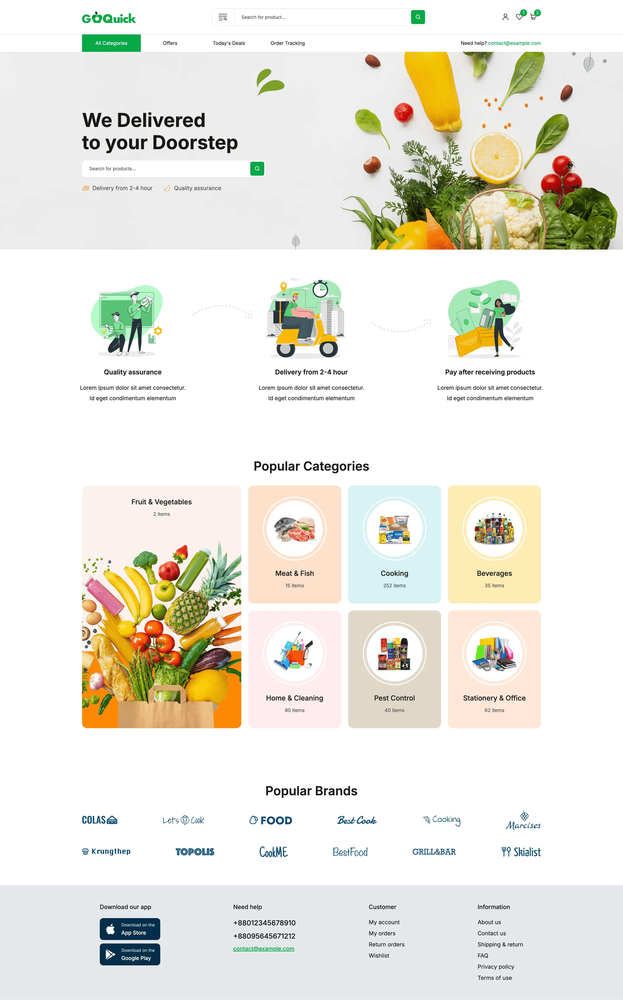

# GoQuick page

## Overview 📌

This is an page to sell groceries online with a small backend, using NodeJS with Express and Supabase for BE and React, Tailwind and Typescript for FE side.

(Note: This project is currently in progress so is not completed yet.)

### Prerequisites ✅

- Node.js `v18+`
- npm or yarn
- You can use [Rest Client](https://marketplace.visualstudio.com/items?itemName=humao.rest-client) or other tools like Postman to test the endpoints

### Setup 🚀

#### Run the server

- Clone the repo

```bash
git clone https://github.com/alexsantosquispe/bob-corn
cd todo-api/server
```

- Install dependencies

```bash
npm install
```

- Start the server

```bash
npm run dev
# The server should run on port 3000
```

- Or Run the server in watch mode

```bash
npm run watch
# The server should run on port 3000
```

#### Test in the browser

(Note: In the frontend side only the GET todos and DELETE todos/:id endpoints were integrated, the other one will be integrated on next commits)

- Install dependencies

```bash
cd todo-api/frontend
npm install
```

- Run the project with React

```bash
npm run dev
```

Open the `http://localhost:5173`

### Screenshots

<div style="display:flex; gap: 12px;">
  
</div>
